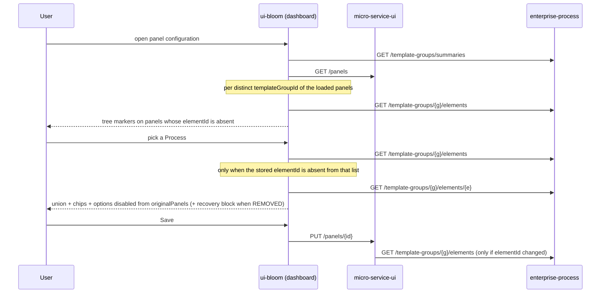

# Feature 56138 — Link a panel with an edited and deployed process template version

**Work item:** US 56138 (parent Feature 54451). **Context:** `workitem-56138-context.md`.
**Services:** `micro-service-enterprise-process`, `micro-service-ui`, `ui-bloom`.
**UI states mockup:** https://claude.ai/code/artifact/3807230b-b0a9-46b4-b3b5-bd90f5509df3

## Goal

A panel binds to a **logical process**, not to one deployed version of it. The element list shows what the
process has now plus what the scheduled version will add or drop, each marked. When a deployment removes the
element a panel points at, the panel keeps its link, says so plainly, and offers one way out.

## Business rules (validated 2026-08-11)

**Stated** — BR-1 two dependent selectors, Element empty until a Process is picked, cleared when it changes ·
BR-2 Process list = active + inactive processes, never Draft-only, never a version · BR-3 Element list =
process node + phases + steps, union of the **active and scheduled** versions only, each element once · BR-4 arriving
element ⇒ chip *"Scheduled from {date}"* · BR-5 departing element ⇒ chip *"Deleted from {date}"*, still
selectable · BR-6 element linked to another panel ⇒ disabled · BR-7 the link survives redeployments ·
BR-8 element gone ⇒ link kept, marker in the panel list (riding up to a collapsed parent) **and**
"(no longer exists)" + recovery block in the form · BR-9 fixed wording: what happened → what still works →
one action; no apology, no error code, never "orphaned".

**Implied** — BR-10 **phase, step and milestone** ids are stable across versions (`requireIdsFromSource`
enforces it) — but the **process node has no stable id**: `requireIdsFromSource` never collects it and each
version is a new document with a new `_id`, which today is what the process-level option carries
(`enterpriseProcessTree.js:19-27`) · BR-11 the panel today stores a *version* id, which is why it goes blank
at handover (55616 §7) · BR-12 `micro-service-ui` currently rejects every non-ACTIVE template and every
unresolvable element · BR-13 one-panel-per-element is enforced client-side over the loaded dashboard and
server-side globally — they disagree today · BR-14 detection is read-time; no scheduler exists ·
BR-15 version statuses stay DRAFT/SCHEDULED/ACTIVE/ARCHIVED, unchanged · BR-16 milestones are excluded ·
BR-17 no union endpoint exists · BR-18 panels are already a tree (`Panel.parentId`).

**Resolved silents (2)** — BR-29 a process whose versions are **all archived**, or archived alongside a draft, is
still listed and selectable, but has **no element list at all**: the Element selector stays disabled and a warning
sits under the Process selector. Only a draft-only process is excluded from the list (PO, 2026-08-11) ·
BR-30 saving the panel configuration must succeed even when nothing changed — including for a panel linked to
such a process, whose element can no longer be re-picked.

**Resolved silents** — BR-19 the new status is **group-level**: `ACTIVE` when **some version of the group
derives ACTIVE**, `INACTIVE` otherwise (PO, 2026-08-11); version-level `ARCHIVED` is already correct, since
the handover truncates a superseded version the instant its successor activates · BR-20 chip date = scheduled version's `min(cycleStartDate)` · BR-21 removal date recomputed at
read time = `max(cycleEndDate) + 1 day` of the latest version that held the element; **no date clause at all
when no version ever deployed it** (R3) · BR-22 an arriving element is not a broken binding · BR-23 an
inactive process is a normal state, no warning · BR-24 dev panels are deleted and recreated · BR-25 taken =
across every dashboard · BR-26 a scheduled-only process states its start date once above the list instead of
chipping every row · BR-27 "Choose another element" is the only action · BR-28 no legacy groups.

## Open questions

None.

## Invariant

A panel's link is `(templateGroupId, elementId)` — two values no deployment ever rewrites, so only the user
can change what a panel points at.

## Decisions

| Decision | Why | Alternative rejected |
|---|---|---|
| Panel stores `{ templateGroupId, elementId, elementLabel }` | The group is the logical process (BR-7/BR-11); the label snapshot is the *only* way to name an element that no version holds any more (the scheduled-version edit case) | Storing a version id and resolving the group on read — leaves the go-blank bug of 55616 §7 alive |
| **The process node's `elementId` is the `templateGroupId` itself** | It is the only process-level identifier that survives a new version — the template `_id` used today belongs to one version and is archived away by the next deploy, which would break BR-7 on precisely the scenario this story exists for | Keeping the version's template id (breaks on every redeploy); minting a stable process-node id in enterprise-process (a new persisted field, for an id the group already provides) |
| Everything that compares an `elementId` against a *template* id is rekeyed to the group | `enterpriseProcess-service.js:37` and `scopeCycleToElement` (`widgets/EnterpriseProcess/utils.js:32`) both test `elementId === template.id`; left alone, every process-level panel renders an empty widget | Adding `templateGroupId` to `CycleDto` — a backend change for a value the panel already holds; `scopeCycleToElement` takes it as an argument instead |
| `elementLabel` is a fallback, not the source of truth | Live name wins whenever the element resolves, and the snapshot is refreshed on every save, so a rename propagates | Always rendering the snapshot — stale names |
| `GET /templates/{id}/active-cycle` is **replaced** by `GET /template-groups/{templateGroupId}/active-cycle` | The only consumer is the dashboard, no production data — keeping both would leave the version-scoped path as a trap | Deprecating alongside |
| ~~Group status is derived: `inactive` ⇔ `now > max(cycleEndDate)` over all versions~~ — superseded 2026-08-11 | ~~one aggregation over the group's cycle bounds~~ | — |
| **Group status is `ACTIVE` when some version of the group derives ACTIVE, `INACTIVE` otherwise** (PO, 2026-08-11) | Reuses `TemplateStatusService.getStatus(Collection)` — one batch call the service already owns, no new cycle-bounds aggregation, and the group's status can never disagree with its versions' | A group-level `max(cycleEndDate)` rule (a second, independent definition of "ended", drifting from the per-version one); an `INACTIVE` value on `TemplateStatus` (conflates a version with a process) |
| Version-level status computation is **untouched** | A superseded version already derives ARCHIVED at the exact instant its successor activates (55616 §1) | Adding a "superseded" branch — touches 56057's class for zero behaviour change and re-breaks 55616 §4.6B's retry path |
| The removal date is a **separate sub-resource**, `GET /template-groups/{g}/elements/{elementId}/removal`, returning `{ removedOn }` alone, called only when the union lookup misses | The client tests membership itself, so the date is the only thing it lacks — and only in the broken state. Since the call happens *because* the element is absent, echoing a `state: "REMOVED"` back would be a constant the caller already knows | `?linkedElementId=` on the union read (a response shape that changes with a parameter, for a value needed on a rare path); a full element-detail resource with a `state` field (a second, unreachable code path resolving live elements) |
| Contract 2 is a **nested tree**, not a flat list with `parentId`/`order` | The consumer is an antd `TreeSelect`; nesting is the shape it wants, and it removes two fields that can disagree with each other (an `order` that contradicts array position, a `parentId` pointing outside the list) | A flat list the client re-assembles — the assembly step existed only because the payload had been flattened first |
| An **inactive process is listed but offers no elements** (`root: null`) rather than being hidden or falling back to its archived version | BR-2 lists inactive processes and BR-29 says the panel keeps its link; publishing an archived version's elements would let a user newly link a panel to a step that no live cycle will ever run | Hiding inactive processes (a panel already linked to one could then never be inspected); falling back to `findCurrentVersion` (silently offers DRAFT then ARCHIVED elements as if live) |
| The panel list computes markers from **one call per distinct group**, client-side | The dashboard already knows every panel's group; distinct groups are few (BR-14) | A cross-service batch endpoint — new contract for a set of ids the client already holds |
| The taken set (BR-6/BR-25) stays client-side, from the panel list the configuration modal already loads | `PanelConfiguration.loadPanels()` calls `getPanels()` directly — the **unfiltered** `GET /panels` (`panel-service.getPanels` → `panelRepository.find()`, no rights filter) — and refreshes it on every open. It already covers every dashboard | A `/panels/enterpriseProcess/taken` endpoint (a round trip for data in hand); switching to redux `originalPanels` (staler — only refreshed after a save) |
| The taken set is keyed on **`(templateGroupId, elementId)`**, not `elementId` alone | `PanelForm.jsx:60-67` keys on the element id alone while the server keys on the pair — the one place the two rules genuinely disagree today | Keying on `elementId` alone — two different processes cannot collide on a UUID, but the client rule then differs from the server's for no reason |
| Existence is validated **only when the link changes**, on **every** write path | Lets the user save a broken panel without applying the recovery (BR-8), while still refusing a newly-picked bogus element. The screen actually saves through the **batch** `PUT /panels` → `assertBatchEnterpriseProcess`, not `PUT /panels/{id}`, and the import path is a third caller — fixing only the single-panel path leaves the whole dashboard save failing | Rewriting only `validateEnterpriseProcess` — the batch is the path the product uses, and it throws before any panel is persisted, so one broken panel blocks saving all of them |
| The "module not enabled" guard also applies **only when the link changes** | It throws before any existence check (`enterpriseProcess-service.js:52-56`), so with the module URL unset an already-linked panel would be permanently unsaveable | Leaving it unconditional |
| Markers live in the **configuration modal's** panel list (`PanelsOrder`), not the navigation tree | That is the list in the screenshot, beside the form where recovery happens, and it is already behind the configure right — so a viewer who cannot act never sees a marker they cannot clear | Marking the nav tree (`PanelHierarchyTree` × 3 instances, each with its own expand state; `PanelSearch` filters rows away; a childless root panel has no row at all) |
| `FMTree` gains an `onExpand` passthrough (`packages/bloom`) | It already tracks expansion internally (`FMTree.jsx:96,180`) but never publishes it, and `PanelsOrder` passes a fixed all-expanded list — so the collapsed-parent roll-up is unimplementable from the dashboard package alone | Deriving the roll-up from the fixed `expandedKeys` prop — it never changes, so no parent is ever collapsed and the AC is untestable |
| The broken Element field renders as a **warning**, with no failing `required` rule | An antd error state disables Save, which contradicts BR-8 | Marking the field invalid |
| Milestones stay out of the Element selector | BR-3 names process node, phases and steps only | Including them "for completeness" |
| No date clause when no version ever deployed the element | The scheduled version owns cycles years out, so `max(cycleEndDate)+1` would print an absurd future date | Using the version's `lastModifiedDate` — drifts on every later edit |

## Flow



## Cross-service contracts — FROZEN

A developer agent that wants to change any shape below **stops and reports**; it does not adapt its own side.

**1. `GET /template-groups/summaries` — owner: enterprise-process**
`200 [{ templateGroupId, name, status: "ACTIVE" | "INACTIVE" }]`. One row per group holding at least one
**non-DRAFT** version. That single predicate already covers both exclusions the earlier wording spelled out:
`TemplateStatusService.compute` derives DRAFT when `deploymentConfig == null` **or** when there are no cycles,
so a never-deployed group and a half-finished deploy (cycles written, config not yet — `deploy()` writes it
last on purpose) are both filtered out, and `hasCycles`-style probing of `effectiveStartDate` is redundant.
`status` is `ACTIVE` when any version of the group derives `TemplateStatus.ACTIVE`, else `INACTIVE` — read
through the existing batch `TemplateStatusService.getStatus(Collection)`, one call for every version of every
listed group. `name` is read off any version of the group: it is immutable across versions
(`requireVersionInvariants` on DRAFT v>1 and SCHEDULED, `TemplateEditPolicy.findStructuralChanges` on ACTIVE),
so resolving a "current version" for it is wasted work. Sorted by `name`, case-insensitively.

**2. `GET /template-groups/{templateGroupId}/elements` — owner: enterprise-process**
```
200 {
  templateGroupId, name,
  scheduledStartDate: "2026-10-01" | null,      // set only when the group has NO active version (BR-26)
  root: {                                       // null when the group has neither an ACTIVE nor a SCHEDULED version
    id, name, level: "PROCESS", state: "PRESENT", effectiveDate: null,
    children: [ { id, name, level: "PHASE"|"STEP",
                  state: "PRESENT"|"ARRIVING"|"LEAVING", effectiveDate: "2026-10-01"|null,
                  children: [ … ] } ]
  }
}
```
- The tree is **nested**: a phase is a child of the process node, a step a child of its phase. There is no
  `parentId` and no `order` — nesting carries both, and array order is the authored order.
- `root` = the union of the version deriving **ACTIVE** and the version deriving **SCHEDULED**, and of nothing
  else. `findCurrentVersion` is deliberately **not** used here: its ranking falls through to DRAFT and then
  ARCHIVED, which would publish a draft's or a retired version's elements as if they were live.
  `PRESENT` in both (or when only one of the two exists); `ARRIVING` only in the scheduled one; `LEAVING` only
  in the active one — a `LEAVING` phase carries its steps as `LEAVING` too. `effectiveDate` = the scheduled
  version's `TemplateState.effectiveStartDate` (BR-20), `null` on `PRESENT`.
- **`root` is `null` when neither an ACTIVE nor a SCHEDULED version exists** (BR-29) — every version archived,
  or archived alongside a draft. The process is still listed by contract 1 (it is `INACTIVE`, not absent), so
  the client renders the warning and leaves the Element selector disabled. `name` is still returned.
- BR-26 falls out of the same rule: with no ACTIVE version there is nothing to union the scheduled version
  with, every node comes back `PRESENT` with no chip, and `scheduledStartDate` carries the date once.
- The `PROCESS` node's `id` is the **`templateGroupId`**, not any version's template id.
- `404` on an unknown `templateGroupId`.

**3. `GET /template-groups/{templateGroupId}/elements/{elementId}/removal` — owner: enterprise-process**
`200 { removedOn: "2026-10-01" | null }`. It answers *since when* the element is gone, and nothing else.
`removedOn` = `TemplateState.effectiveEndDate + 1 day` of the greatest-`versionNumber` version whose element
tree holds that id — `null` when no version holds it, and `null` when that version has no cycles at all
(BR-21/R3). The panel form calls it **only** when the id is absent from contract 2's tree, so the endpoint
does not re-state a `state` the caller already computed: reaching it *is* the removed case.
`404` on an unknown group, **never** on an unknown element.

**4. `GET /template-groups/{templateGroupId}/active-cycle` — owner: enterprise-process**
Replaces `GET /templates/{processTemplateId}/active-cycle`, same `CycleDto` body, `204` when no version of
the group is active, `404` on an unknown group.

**5. Panel write paths — owner: micro-service-ui**
`enterpriseProcess: { templateGroupId, elementId, elementLabel } | null`. `templateGroupId` and `elementId`
are required within the object; **`elementLabel` is not** — a required third key would 400 the next write of
any pre-existing document. Rejects (400) an object missing either required key.

The rule below applies identically to **all three** write paths — `PUT /panels/{id}`
(`validateEnterpriseProcess`), the batch **`PUT /panels`** (`assertBatchEnterpriseProcess`, which is what the
configuration modal actually calls), and the import path (`createNewPanels` / `editOldPanels`):

- the `status === 'ACTIVE'` guard is **removed** (BR-2 lists inactive processes);
- existence is checked against contract 2 **only when the incoming `(templateGroupId, elementId)` differs
  from the stored one** — the batch path must therefore load the stored panels to compare, which it already
  does for the hierarchy checks;
- the "module not enabled" guard likewise fires only on a changed link;
- the one-panel-per-element check always runs, rekeyed to `(templateGroupId, elementId)`.

The batch stays all-or-nothing: with existence checked only on a *changed* link, and links only ever chosen
from contract 2's list, a rejection means a client bug — not one stale panel blocking a dashboard save.

## Existing data & migration

There is **no production data** for enterprise-process or for the panel↔process link, and no migration to
plan. `micro-service-ui` has no migration framework: dev panels carrying the old
`{ processTemplateId, elementId }` shape are **deleted and recreated** by hand. Mongoose ignores the stale
`processTemplateId` key on read, so no cleanup script is needed. `micro-service-enterprise-process` gains
**no field and no collection** — group status and the union are computed from documents that already exist.
The change works identically on a fresh environment and a wiped dev one.

## Acceptance criteria — end-to-end walk

- **Empty / dependent selectors** → form opens with `enterpriseProcess == null` → Process shows its
  placeholder, Element is **disabled** with "Select an enterprise process first" → picking a Process fires
  contract 2 → Element becomes enabled → picking another Process **must clear the stored elementId before
  the new list arrives**, otherwise the old element flashes as selected against a foreign list.
- **Existing association** → form opens with `{ templateGroupId, elementId }` → contract 2 is called → the
  element is found and `PRESENT` → both selectors render filled, no chip, no alert, no second call.
- **Active + Scheduled + Inactive listed, Draft and Archived not** → contract 1 returns groups, so an archived
  *version* has no row to appear in, and a group with no `cycle_data` is filtered server-side.
- **Union with chips** → group has an active and a scheduled version → `elements` carries one entry per id
  with a `state` → the client renders a chip from `state` + `effectiveDate`, never by comparing two lists
  itself.
- **Departing element stays selectable** → `state = LEAVING` sets a chip, never `disabled`.
- **Already linked** → the taken set is built from the modal's own panel list — the **unfiltered** `GET /panels`
  payload it reloads on every open, which is why it covers every dashboard — keyed on
  `(templateGroupId, elementId)` and excluding the panel being edited → those options render disabled with
  the holding panel's title.
- **Link preserved across redeployment** → nothing in the deploy path writes to panels, and the panel's key
  is the group id, so activation changes **which version answers**, never what the panel stores.
- **Inactive process, no live version** → contract 2 answers `root: null` → the Process selector shows the
  process (contract 1 still lists it, `INACTIVE`), a warning sits beneath it, the Element selector stays
  **disabled**, and **Save still succeeds** with the link untouched (BR-29/BR-30): `micro-service-ui` only
  validates existence when the `(templateGroupId, elementId)` pair changes, and here it cannot change.
- **Broken binding, panel form** → after activation the element is absent from contract 2's tree → the form
  calls contract 3, which answers `{ removedOn }` (a date, or `null`) → the selector renders `elementLabel` +
  "(no longer exists)" and the recovery block →
  **Save stays enabled**, because the field carries no failing rule and `micro-service-ui` skips existence
  validation for an unchanged id → saving keeps the broken link, which is the AC "not automatically unlinked".
- **Broken binding, panel list** → on open the modal fetches contract 2 once per distinct group of its panels
  → a panel whose `elementId` is missing from that group's tree — including every panel of a group whose `root` is `null` — is marked in `PanelsOrder` → **the
  marker must survive the tree re-render on expand/collapse**, so the broken set lives in
  `PanelConfiguration` state, not in tree node state. A group whose fetch fails contributes **no** markers —
  never a false one.
- **Roll-up to a collapsed parent** → marker set is `{panelId}`; a row renders the marker when it is broken
  itself, or when it is **collapsed** and any descendant is broken (rendered lighter). This requires
  `FMTree` to publish its expansion through a new `onExpand` prop — today it keeps it internal and
  `PanelsOrder` hands it a fixed all-expanded list, so no parent is ever collapsed from the caller's point of
  view and the AC cannot be exercised at all.
- **Wording** → the recovery block is three fixed fragments plus one button; the date clause is omitted
  entirely when `removedOn` is null. Assert in the test that the rendered text contains no apology, no code,
  and not the word "orphaned".

## UI states

The full state table and every rendering is in the mockup linked above (S1–S9 plus the summary table). The
screenshot supplied with the work item is the **current** screen, not a target: it pins one state only
(populated happy path, single select, tree with no markers). Everything else — the two-selector split, chips,
disabled options, "(no longer exists)", the recovery block, the tree marker and its roll-up — is proposed
here and has no precedent in the codebase.

Minimum coverage, all owned by `PanelForm` unless stated: empty · loading · error · process-chosen ·
union · arriving · leaving · taken · scheduled-only · linked · broken · recovering · after-save ·
row-broken (`PanelHierarchyTree`) · parent-collapsed (`PanelHierarchyTree`) · unlinked panel.

## Per-service scope

- **micro-service-enterprise-process** — group summaries with derived group status; the union-of-versions
  element read with per-element state, dates and the removed-element answer; the group-scoped active-cycle
  endpoint replacing the version-scoped one.
- **micro-service-ui** — panel schema keyed on `templateGroupId` + `elementLabel`; the duplicate-link query
  rekeyed on the group; validation rewritten to check existence only on change and to stop rejecting
  non-active processes. **No new endpoint.**
- **ui-bloom** — mostly `packages/dashboard`: the two dependent selectors with chips and disabled options;
  the broken-binding rendering and recovery action; the `PanelsOrder` marker and its roll-up; **every
  consumer of `enterpriseProcess.processTemplateId`** — `usePanelActiveCycle`, `useActiveCyclePhases`,
  `useActiveCycleTimeline`, `isPanelLinkedToEnterpriseProcess` (which gates the whole Enterprise Process
  widget catalog via `useFilterWidgets`), `scopeCycleToElement`, and the matching propTypes; group-scoped
  active cycle; the load-error state `PanelConfiguration` currently swallows into an empty list; English
  locale keys. Plus one change in `packages/bloom`: an `onExpand` prop on `FMTree`.

## Out of scope

Cancelling a scheduled deployment (56137) · editing deployment dates (56352) · version tags in the
enterprise-process UI (55952) · the cycle selector built on 56754's `/template-groups/{id}/cycles` ·
milestones as linkable elements · any change to how a version's status is computed · propagating an edit
from one version to another.

## Risks

- **A stale `elementLabel` is user-visible only in the broken state**, where nothing can refresh it. Accepted:
  it is the last known name of a thing that no longer exists, which is what the message says.
- **The taken set depends on `GET /panels` staying unfiltered.** It is today (`panelRepository.find()`, no
  rights filter). If a future story scopes that read by rights, the client-side taken check silently stops
  covering "every dashboard" and the failure resurfaces only at save time.
- **One-panel-per-element is a read-then-write with no unique index**, so two concurrent saves can both pass.
  Pre-existing (`panel-repository.findByEnterpriseProcess`), not introduced here, and not closed here —
  a unique partial index on `(enterpriseProcess.templateGroupId, enterpriseProcess.elementId)` would be the
  fix if it ever matters. "Enforced server-side" means on every write path, not atomically.
- **A process whose first deployment is still scheduled is labelled `INACTIVE`.** It follows from BR-19 as the
  PO defined it — no version derives ACTIVE yet — and it reads oddly for a process that has not started
  rather than ended. Its elements still list correctly (all `PRESENT`, with `scheduledStartDate` stating the
  start date once), so this is a label, not a behaviour. Flag it if the wording bothers the PO.
- **Broken-binding markers are invisible outside the configuration modal.** A user browsing panels sees a
  panel with no cycle dates and no explanation until someone opens the configuration. Deliberate: the marker
  is actionable only where the recovery lives.
- **`removedOn` costs a scan of the group's versions** for a removed element. Bounded by the version count,
  and only on a form that is already in the broken state.
- **The union's "current version" for an inactive group** is the one with the greatest `max(cycleEndDate)`,
  not a status. If a group ever holds two versions ending at the same instant, the tie is arbitrary — dev-only
  and unreachable through the product.
- **`micro-service-ui` is absent from root `AGENTS.md`** despite owning panel persistence. A bullet is added
  with this feature.
